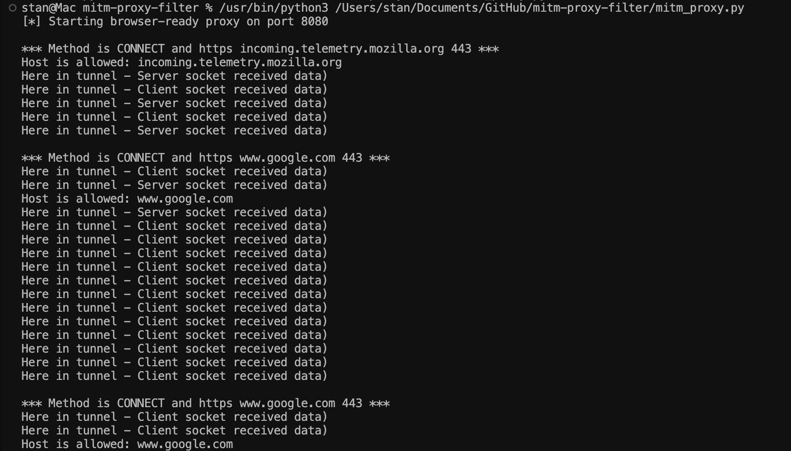
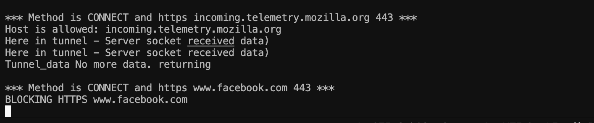
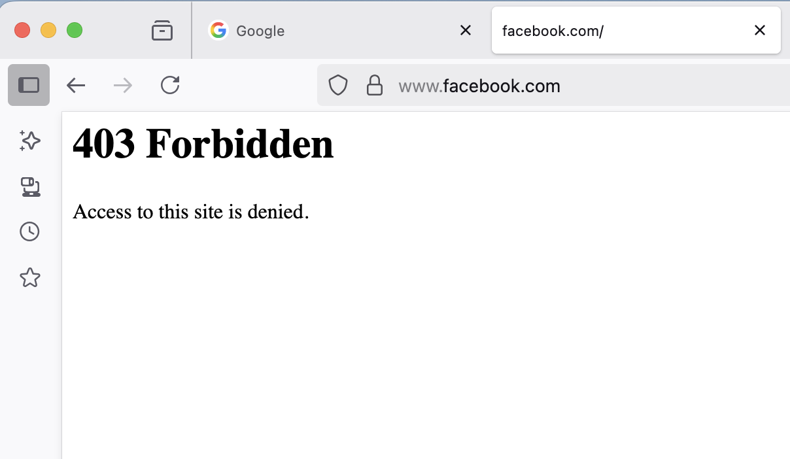

# SafeSpace Proxy

hey, welcome to SafeSpace — a lil browser-ready proxy i built in python.  
it catches your http + https traffic, blocks sketchy or unwanted domains (yes, u facebook), and logs who tried what.

i made it mostly for learning, testing, and messing around with TLS interception and network flows.  
so yeah, use it to spy on yourself.

---

## what it does

- intercepts HTTP and HTTPS traffic  
- dynamically generates TLS certs signed by your own fake CA  
- blocks any domains you choose (hardcoded for now)  
- sends “403 forbidden” html back if it blocks smth  
- logs all blocked attempts with IP + timestamp  
- tunnels the rest of traffic just like a normal proxy

---

## how to run it


### 1. tell your system to trust your CA:

```bash
export REQUESTS_CA_BUNDLE=/path/to/your/RootCA.pem
export SSL_CERT_FILE=/path/to/your/RootCA.pem
```

> tip: you can add these lines to your `~/.bash_profile` or `~/.zshrc` to set them automatically on shell start.

### 2. run the proxy:

```bash
python3 proxy_server.py
```

### 3. set your browser or curl to use it

for curl:
```bash
curl -x http://127.0.0.1:8080 http://example.com
```

for browser (e.g. firefox):
- go to network settings
- set manual proxy: `HTTP proxy` = `127.0.0.1`, port = `8080`
- tick the box to also use this proxy for HTTPS

---

enjoy sniffing your own traffic

---

### sample screenshots

#### intercepted request (google.com)


#### terminal logs when facebook.com is blocked


#### browser showing 403 forbidden for facebook.com


> all traffic is intercepted, domains in the blocklist are denied access with a friendly html message, and everything’s logged for review.

---

### terminal output example

```
*** Method is CONNECT and https incoming.telemetry.mozilla.org 443 ***
Host is allowed: incoming.telemetry.mozilla.org 
Here in tunnel - Server socket received data)
Here in tunnel - Server socket received data)
Tunnel_data No more data. returning

*** Method is CONNECT and https www.facebook.com 443 ***
BLOCKING HTTPS www.facebook.com 

*** Method is CONNECT and https www.google.com 443 ***

*** Method is CONNECT and https ads.mozilla.org 443 ***
Host is allowed: www.google.com 
Here in tunnel - Server socket received data)
```
